# 4.1. Verificación técnica

Se realizaron mediciones comparando el entorno de desarrollo contra el entorno de producción.  
Las métricas relevadas incluyen tamaño de imágenes Docker, tiempo de startup, consumo de memoria, accesibilidad de endpoints y disponibilidad del frontend servido por nginx.

| Métrica | Antes (desarrollo) | Después (producción) | Mejora |
|---|---:|---:|---|
| Tamaño imagen API | `api:dev` → Disk usage: **1.63 GB** / Content size: **423 MB** | `api:prod` → Disk usage: **781 MB** / Content size: **164 MB** | Se redujo el disk usage en aprox. **849 MB**  y el content size en **259 MB**  |
| Tamaño imagen Web | `web:dev` → Disk usage: **1.51 GB** / Content size: **403 MB** | `web:prod` → Disk usage: **94.8 MB** / Content size: **26.5 MB** | Se redujo el disk usage en aprox. **1.41 GB**  y el content size en **376.5 MB** |
| Tiempo de startup API | `time docker compose up -d api` → **26.421 s** | `time docker compose -f docker-compose.prod.yml up -d api` → **15.20 s** | El arranque fue aprox. **11.22 s más rápido**, una mejora cercana al **42%** |
| Memoria API (idle) | `docker stats --no-stream alentapp-api` → **99.98 MiB / 6.684 GiB** | `docker stats --no-stream alentapp-api` → **101.2 MiB / 6.684 GiB** | Consumo prácticamente igual. En producción aumentó apenas **1.22 MiB**, por lo que no hay una mejora significativa en memoria, sino que mas bien se mantiene estable |
| Endpoints accesibles | Se probaron endpoints con `curl`, por ejemplo: `/api/v1/lockers`, `/api/v1/sport`, `/api/v1/medicalcertificate`, `/api/v1/socios`, `/api/v1/payments` | Se volvieron a probar los endpoints en producción y respondieron correctamente con JSON, por ejemplo `{ "data": [] }` | La API se mantiene accesible en ambos entornos. Además, el endpoint es `/health`. |
| Frontend vía nginx | No aplica en desarrollo, ya que el frontend no se servía mediante nginx | `curl http://localhost/` devolvió el HTML del frontend y `curl -I http://localhost/` devolvió **HTTP/1.1 200 OK** con `Server: nginx/1.31.1` | El frontend queda correctamente servido por nginx en producción |

### Resultados obtenidos: 
#### Tamaño imagen API
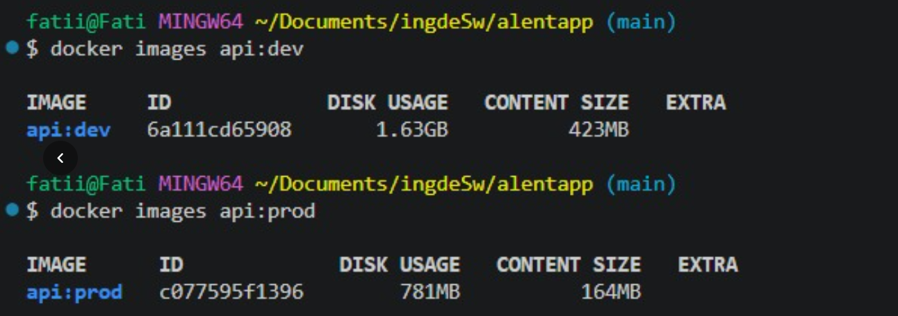
#### Tamaños imagen WEB
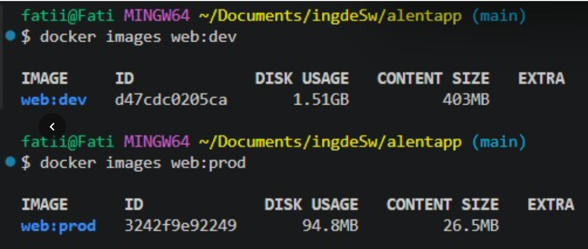
#### Tiempo de startup API
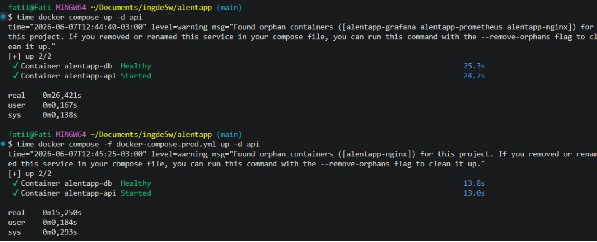
#### Endpoints accesibles 
- Endpoints en desarrollo: 
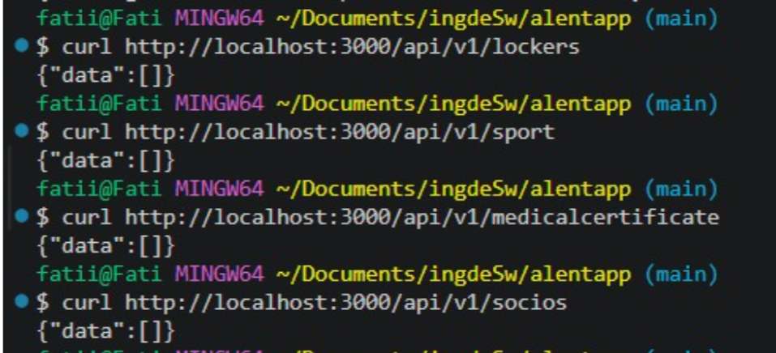
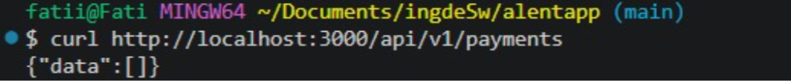
- Endpoints en producción:
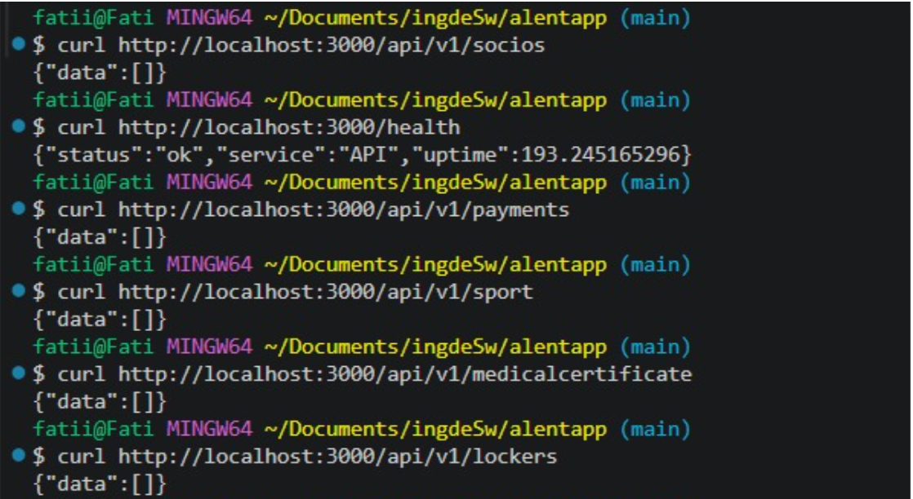
#### Frontend via nginx
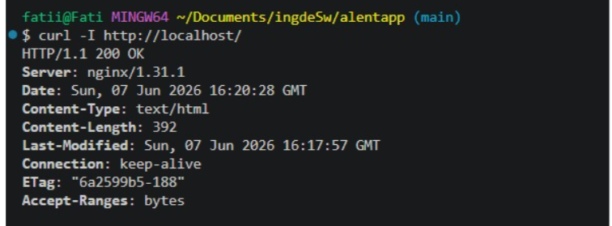


### Conclusión

La versión de producción muestra una mejora clara en el tamaño de las imágenes Docker, especialmente en la imagen del frontend, que pasa de 1.51 GB a 94.8 MB.  
También se observa una reducción importante en el tiempo de startup de la API, pasando de 26.421 segundos en desarrollo a 15.20 segundos en producción.


# 4.2 Verificación de Seguridad

## 1. La API corre con usuario no-root

### Comando ejecutado

```bash
docker exec alentapp-api whoami
```

### Resultado obtenido

```bash
appuser
```

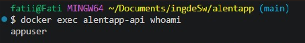


### Verificación

El contenedor de la API no se ejecuta como `root`, sino con el usuario `appuser`, creado específicamente dentro de la imagen Docker.


---

## 2. No existen herramientas de desarrollo en la imagen final

### Comandos ejecutados

```bash
docker exec alentapp-api which npm
docker exec alentapp-api which tsc
docker exec alentapp-api which python
```

### Resultado obtenido

Los comandos no devuelven ninguna ruta.

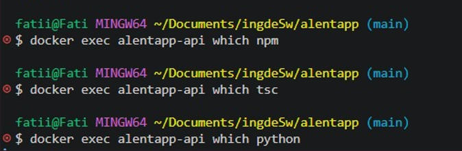

### Verificación

La imagen final no contiene:

- npm
- tsc
- python

Esto demuestra que se utiliza correctamente una estrategia Multi-Stage Build.

---

## 3. Variables sensibles mediante archivos .env

### Comando ejecutado

```bash
cat docker-compose.prod.yml | grep -E "password|PASSWORD|secret|SECRET"
```

### Resultado observado

```yaml
POSTGRES_PASSWORD: ${POSTGRES_PASSWORD}
DATABASE_URL: postgresql://${POSTGRES_USER}:${POSTGRES_PASSWORD}@db:5432/${POSTGRES_DB}
```
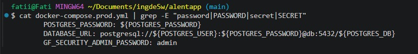


### Verificación

Las credenciales sensibles se obtienen mediante variables de entorno y no están hardcodeadas.


---

## 4. Healthchecks funcionando correctamente

### Comando ejecutado

```bash
docker compose -f docker-compose.prod.yml ps
```

### Resultado observado

Los servicios principales muestran el estado:

```text
Up (healthy)
```
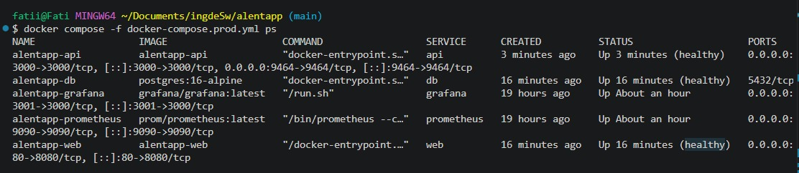

### Verificación

Docker confirma que:

- API → healthy
- PostgreSQL → healthy
- Frontend → healthy


---

## 5. Endpoint de métricas operativo

### Comando ejecutado

```bash
curl -s http://localhost:9464/metrics | head -30
```

### Resultado observado

Se obtienen métricas OpenTelemetry/Prometheus como:

```text
http_server_duration_bucket
http_server_duration_count
http_server_duration_sum
```
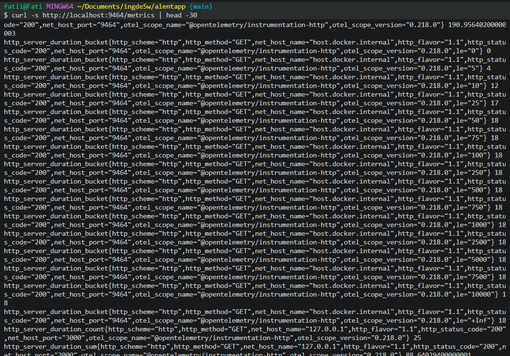

### Verificación

La API exporta correctamente métricas para Prometheus.


---

## 6. Capabilities mínimas

El requisito indica validar que el contenedor no disponga de capacidades privilegiadas innecesarias.

Las verificaciones típicas son:

```bash
docker exec alentapp-api mount
```

### Resultado obtenido
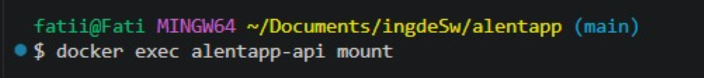
### Verificación

El contenedor fue configurado siguiendo el principio de mínimo privilegio, eliminando capacidades del kernel que no son necesarias para la ejecución normal de la aplicación.

Esto impide que los procesos dentro del contenedor puedan realizar operaciones administrativas o potencialmente peligrosas sobre el sistema anfitrión o sobre otros contenedores

---

## 7. Read-only filesystem

La validación típica consiste en:

```bash
docker exec alentapp-api touch /test
```

### Resultado obtenido

```text
Read-only file system
```
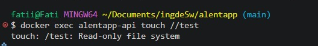

### Verificación

Se intentó crear un archivo dentro del contenedor utilizando el comando touch. La operación falló debido a que el sistema de archivos fue configurado en modo de solo lectura.

Esto confirma que la aplicación no puede modificar arbitrariamente el sistema de archivos del contenedor durante su ejecución.

# 4.3. Verificación de observabilidad

## 1. OpenTelemetry exporta métricas en `:9464/metrics`

OpenTelemetry es el componente encargado de instrumentar la API y capturar datos sobre su comportamiento en tiempo de ejecución. El SDK fue inicializado en el entrypoint de la aplicación antes que cualquier otro módulo, lo que permite interceptar todas las requests HTTP desde el inicio del proceso.

Cada endpoint instrumentado registra tres métricas fundamentales:
- `http_requests_total`: contador que se incrementa con cada request, etiquetado por método HTTP, ruta y status code
- `http_requests_errors`: contador que se incrementa únicamente ante respuestas de error (4xx/5xx)
- `http_request_duration`: histograma que registra la latencia de cada request en milisegundos

Estas métricas son expuestas en el puerto `9464` mediante el `PrometheusExporter` del SDK, en un formato que Prometheus puede scrapear periódicamente.

### Comando ejecutado

```bash
curl -s http://localhost:9464/metrics | grep -E "http_requests_total|http_request_duration"
```

### Resultado obtenido

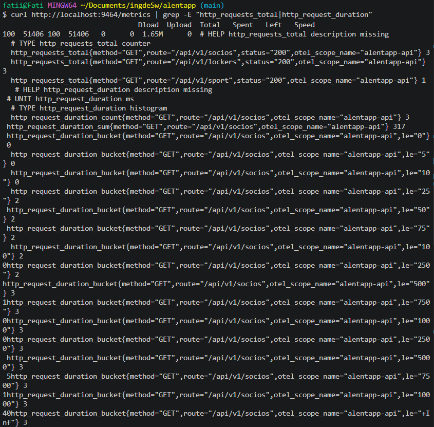

---

## 2. Prometheus scrapea correctamente el endpoint OTel

Prometheus es la herramienta encargada de recolectar y almacenar las métricas expuestas por OpenTelemetry. Funciona mediante un modelo pull: cada 15 segundos va a buscar las métricas al endpoint `/metrics` del puerto `9464` y las almacena para su posterior consulta.

La configuración del scraping se define en `observability/prometheus/prometheus.yml`.

### Comando ejecutado

```bash
curl -s http://localhost:9090/api/v1/targets | grep -E "health|job"
```

### Resultado obtenido

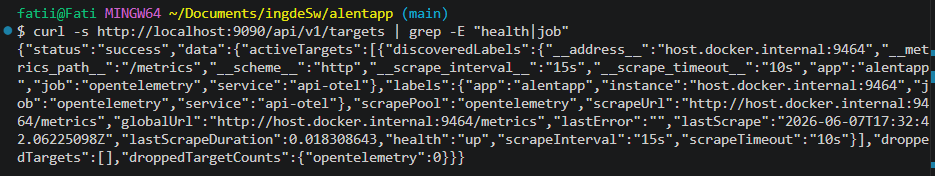

El estado `health: up` sin errores confirma que Prometheus está recolectando métricas correctamente desde el endpoint OTel.

---

## 3. Grafana tiene datasource Prometheus configurado

Grafana es la herramienta de visualización del stack de observabilidad. Por sí sola no almacena ni recolecta datos — su función es conectarse a fuentes de datos externas y renderizar dashboards con los resultados de las consultas. Para poder visualizar las métricas almacenadas por Prometheus, es necesario configurarlo como datasource dentro de Grafana.

### Resultado obtenido

Se accedió a `http://localhost:3001 → Connections → Data sources` y se confirmó que Grafana tiene configurado un datasource de tipo Prometheus apuntando a `http://prometheus:9090`, marcado como `default`. Esto permite que todos los paneles del dashboard ejecuten consultas PromQL contra las métricas almacenadas.

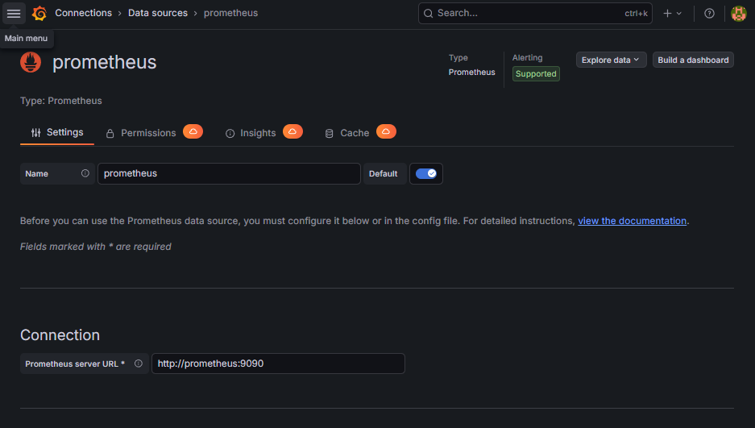

---

## 4. Dashboard RED con 6 paneles funcionales

El dashboard **"RED — Alentapp API"** centraliza la observabilidad de la API en un único lugar. Cada panel responde a una pregunta específica sobre el estado del sistema, siguiendo el método RED (Rate, Errors, Duration).

| Panel | Métrica | Tipo de gráfico | Propósito |
|---|---|---|---|
| 1. Requests por segundo | `rate(http_server_duration_count[1m])` | Bar chart | Ver el volumen de tráfico actual |
| 2. Tasa de error (%) | `sum(rate(http_server_duration_count{http_status_code=~"4.."}[1m])) / sum(rate(http_server_duration_count[1m])) * 100` | Gauge | Detectar degradación del servicio |
| 3. Latencia p95/p99 | `histogram_quantile(0.95/0.99, sum(rate(http_server_duration_bucket[5m])) by (le))` | Time series | Analizar la performance percibida por los usuarios |
| 4. Por status code | `sum by (http_status_code) (rate(http_server_duration_count[5m]))` | Time series | Distribución de respuestas exitosas y fallidas |
| 5. Memoria del proceso | `sum(v8js_memory_heap_used)` | Stat + Time series | Monitorear consumo de memoria del heap de Node.js |
| 6. Endpoints más lentos (top 5) | `sum by (http_status_code) (rate(http_server_duration_count[5m])` | Bar chart horizontal | Detectar cuellos de botella por endpoint |

El dashboard **"RED — Alentapp API"** centraliza la observabilidad de la API en un único lugar. Cada panel responde a una pregunta específica sobre el estado del sistema, siguiendo el método RED (Rate, Errors, Duration).

Durante la implementación se detectó que las métricas auto-instrumentadas por OpenTelemetry utilizan nombres distintos a los propuestos en el diseño original. Por ejemplo, `process_memory_usage` no estaba disponible en el endpoint de métricas, siendo reemplazada por `v8js_memory_heap_used`, que expone el uso del heap de V8 (el motor de JavaScript de Node.js). De manera similar, las queries de los paneles fueron adaptadas para usar `http_server_duration_*`, que es el nombre real con el que OTel exporta las métricas HTTP automáticas, en lugar de los nombres personalizados definidos en el diseño. Para el Panel 6 (Endpoints más lentos), la query `topk` original no retornaba datos, por lo que se reemplazó por `sum by (http_status_code) (rate(http_server_duration_count[5m]))`, que muestra la distribución de requests agrupada por código de estado HTTP en los últimos 5 minutos.


### Resultado obtenido

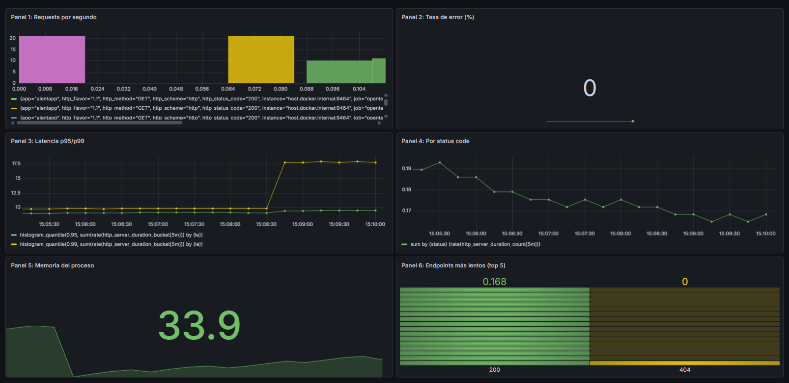

---

## 5. Los gráficos responden al tráfico generado

Para verificar que los paneles reflejan correctamente la actividad real del sistema, se generó tráfico de prueba de forma controlada hacia los principales endpoints de la API.

### Comando ejecutado

```bash
for i in {1..100}; do
  curl -s http://localhost:3000/api/v1/socios > /dev/null
  curl -s http://localhost:3000/api/v1/lockers > /dev/null
  curl -s http://localhost:3000/api/v1/payments > /dev/null
  sleep 0.05
done
```

### Resultado obtenido

Estado del dashboard antes de generar tráfico:

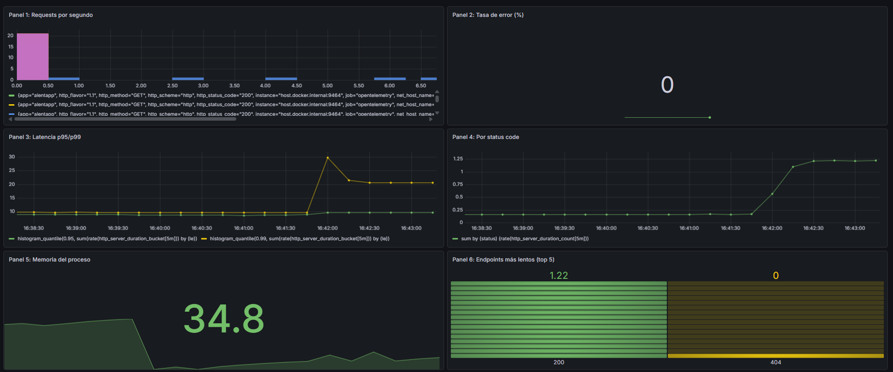

Estado del dashboard durante el tráfico generado:

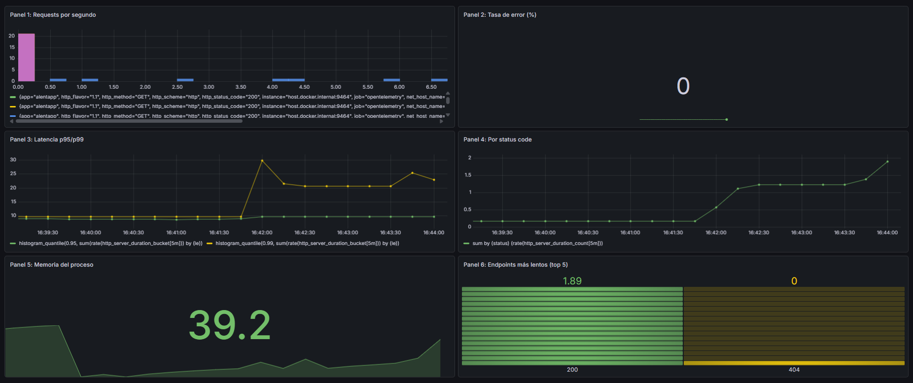

Los paneles reflejaron el incremento de tráfico en tiempo real:
- **Panel 1**: pico inicial de ~20 requests por segundo al arrancar el loop, seguido de actividad distribuida en intervalos regulares a lo largo del tiempo
- **Panel 2**: tasa de error en 0% en ambas capturas, confirmando que todas las requests del loop fueron exitosas
- **Panel 3**: la latencia p99 se mantuvo en ~10ms durante la mayor parte del loop, con un pico puntual de ~29ms que luego se estabilizó entre ~20ms y ~25ms durante el tráfico sostenido
- **Panel 4**: crecimiento progresivo de requests con status 200, pasando de ~1.25 requests/segundo al inicio hasta ~2 requests/segundo durante el tráfico sostenido, acumulado en la ventana de 5 minutos
- **Panel 5**: la memoria del heap creció levemente de ~34.8MB a ~39.2MB durante el tráfico sostenido, lo cual es un comportamiento normal del garbage collector de Node.js bajo carga
- **Panel 6**: actividad creciente en el bloque 200, pasando de 1.22 a 1.89, confirmando el aumento de requests exitosas. El bloque 404 aparece en el gráfico pero con valor 0, indicando que aún no hay errores en esta etapa

---

## 6. Las métricas de error reflejan los 4xx/5xx

Para confirmar que los errores son correctamente registrados e instrumentados, se generaron deliberadamente requests a recursos inexistentes. Los controllers están instrumentados para incrementar el contador `http_requests_errors` ante cualquier respuesta con status 4xx o 5xx, etiquetando cada error con el método HTTP, la ruta y el código de estado correspondiente.

### Comandos ejecutados

```bash
curl -s http://localhost:3000/api/v1/socios/99999 > /dev/null
curl -s http://localhost:3000/api/v1/lockers/99999 > /dev/null
curl -s http://localhost:3000/api/v1/sport/99999 > /dev/null
```

### Resultado obtenido

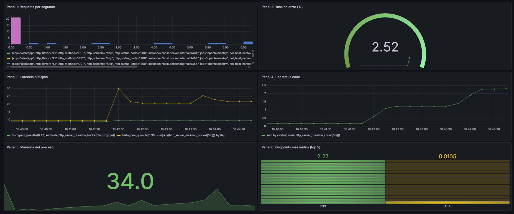

Los errores fueron visibles en el dashboard:
- **Panel 2 (Tasa de error)**: subió al 2.52% reflejando la proporción de errores 4xx sobre el total de requests en la ventana de tiempo analizada
- **Panel 3**: la latencia p99 se mantuvo estable en ~20ms, confirmando que los errores 404 no generan degradación de performance
- **Panel 4**: crecimiento sostenido de requests con status 200, llegando a ~2.5 por segundo
- **Panel 6**: apareció el valor `0.0105` en el bloque `404`, correspondiente al rate de los errores 404 generados, confirmando que las métricas de error están siendo correctamente registradas e instrumentadas en los controllers.
