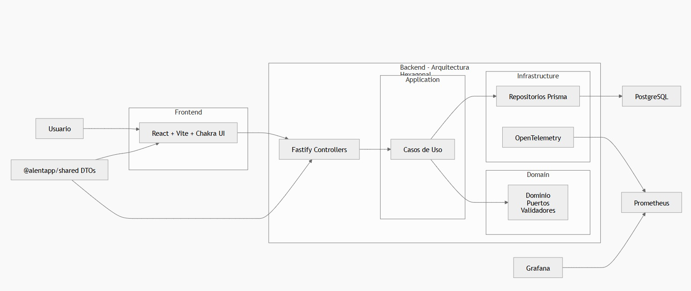
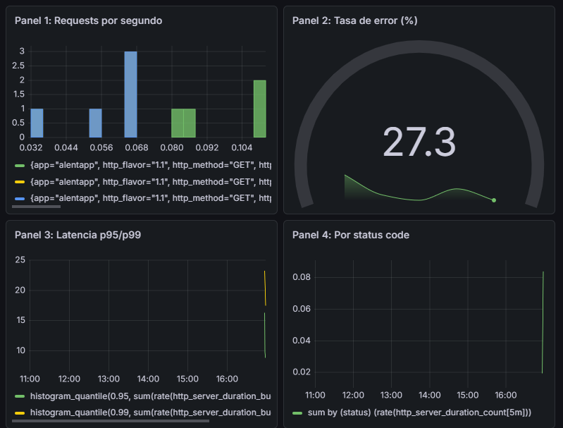
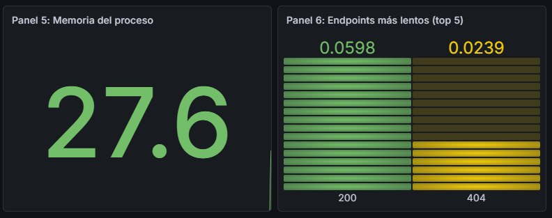
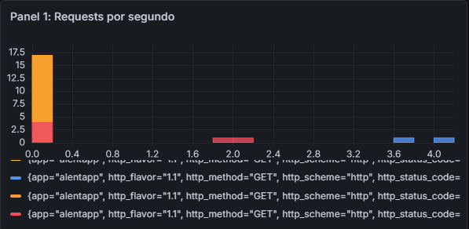
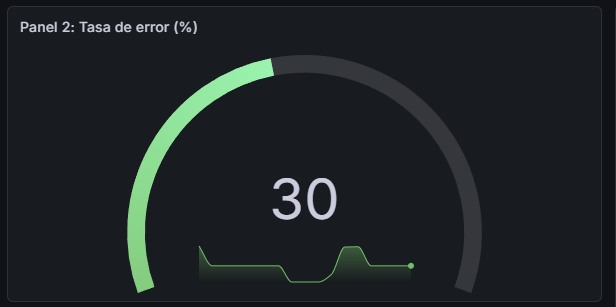
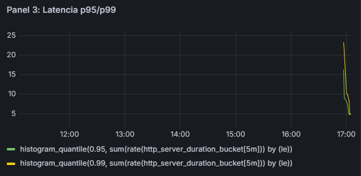
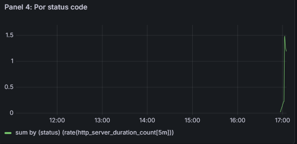
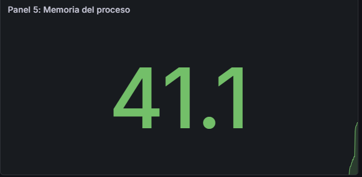
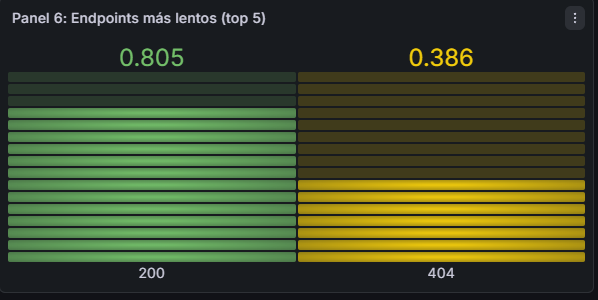

# 4.1. Verificación técnica

Se realizaron mediciones comparando el entorno de desarrollo contra el entorno de producción.  
Las métricas relevadas incluyen tamaño de imágenes Docker, tiempo de startup, consumo de memoria, accesibilidad de endpoints y disponibilidad del frontend servido por nginx.

| Métrica | Antes (desarrollo) | Después (producción) | Mejora |
|---|---:|---:|---|
| Tamaño imagen API | `api:dev` → Disk usage: **1.63 GB** / Content size: **423 MB** | `api:prod` → Disk usage: **781 MB** / Content size: **164 MB** | Se redujo el disk usage en aprox. **849 MB**  y el content size en **259 MB**  |
| Tamaño imagen Web | `web:dev` → Disk usage: **1.51 GB** / Content size: **403 MB** | `web:prod` → Disk usage: **94.8 MB** / Content size: **26.5 MB** | Se redujo el disk usage en aprox. **1.41 GB**  y el content size en **376.5 MB** |
| Tiempo de startup API | `time docker compose up -d api` → **26.421 s** | `time docker compose -f docker-compose.prod.yml up -d api` → **15.20 s** | El arranque fue aprox. **11.22 s más rápido**, una mejora cercana al **42%** |
| Memoria API (idle) | `docker stats --no-stream alentapp-api` → **99.98 MiB / 6.684 GiB** | `docker stats --no-stream alentapp-api` → **101.2 MiB / 6.684 GiB** | Consumo prácticamente igual. En producción aumentó apenas **1.22 MiB**, por lo que no hay una mejora significativa en memoria, sino que mas bien se mantiene estable |
| Endpoints accesibles | Se probaron endpoints con `curl`, por ejemplo: `/api/v1/lockers`, `/api/v1/sport`, `/api/v1/medicalcertificate`, `/api/v1/socios`, `/api/v1/payments` | Se volvieron a probar los endpoints en producción y respondieron correctamente con JSON, por ejemplo `{ "data": [] }` | La API se mantiene accesible en ambos entornos. Además, el endpoint es `/health`. |
| Frontend vía nginx | No aplica en desarrollo, ya que el frontend no se servía mediante nginx | `curl http://localhost/` devolvió el HTML del frontend y `curl -I http://localhost/` devolvió **HTTP/1.1 200 OK** con `Server: nginx/1.31.1` | El frontend queda correctamente servido por nginx en producción |

### Resultados obtenidos: 
#### Tamaño imagen API

#### Tamaños imagen WEB

#### Tiempo de startup API

#### Endpoints accesibles 
- Endpoints en desarrollo: 


- Endpoints en producción:

#### Frontend via nginx


### Conclusión

La versión de producción muestra una mejora clara en el tamaño de las imágenes Docker, especialmente en la imagen del frontend, que pasa de 1.51 GB a 94.8 MB.  
También se observa una reducción importante en el tiempo de startup de la API, pasando de 26.421 segundos en desarrollo a 15.20 segundos en producción.


# 4.2 Verificación de Seguridad

## 1. La API corre con usuario no-root

### Comando ejecutado

```bash
docker exec alentapp-api whoami
```

### Resultado obtenido

```bash
appuser
```


### Verificación

El contenedor de la API no se ejecuta como `root`, sino con el usuario `appuser`, creado específicamente dentro de la imagen Docker.


---

## 2. No existen herramientas de desarrollo en la imagen final

### Comandos ejecutados

```bash
docker exec alentapp-api which npm
docker exec alentapp-api which tsc
docker exec alentapp-api which python
```

### Resultado obtenido

Los comandos no devuelven ninguna ruta.


### Verificación

La imagen final no contiene:

- npm
- tsc
- python

Esto demuestra que se utiliza correctamente una estrategia Multi-Stage Build.

---

## 3. Variables sensibles mediante archivos .env

### Comando ejecutado

```bash
cat docker-compose.prod.yml | grep -E "password|PASSWORD|secret|SECRET"
```

### Resultado observado

```yaml
POSTGRES_PASSWORD: ${POSTGRES_PASSWORD}
DATABASE_URL: postgresql://${POSTGRES_USER}:${POSTGRES_PASSWORD}@db:5432/${POSTGRES_DB}
```


### Verificación

Las credenciales sensibles se obtienen mediante variables de entorno y no están hardcodeadas.


---

## 4. Healthchecks funcionando correctamente

### Comando ejecutado

```bash
docker compose -f docker-compose.prod.yml ps
```

### Resultado observado

Los servicios principales muestran el estado:

```text
Up (healthy)
```


### Verificación

Docker confirma que:

- API → healthy
- PostgreSQL → healthy
- Frontend → healthy


---

## 5. Endpoint de métricas operativo

### Comando ejecutado

```bash
curl -s http://localhost:9464/metrics | head -30
```

### Resultado observado

Se obtienen métricas OpenTelemetry/Prometheus como:

```text
http_server_duration_bucket
http_server_duration_count
http_server_duration_sum
```


### Verificación

La API exporta correctamente métricas para Prometheus.


---

## 6. Capabilities mínimas

El requisito indica validar que el contenedor no disponga de capacidades privilegiadas innecesarias.

Las verificaciones típicas son:

```bash
docker exec alentapp-api mount
```

### Resultado obtenido

### Verificación

El contenedor fue configurado siguiendo el principio de mínimo privilegio, eliminando capacidades del kernel que no son necesarias para la ejecución normal de la aplicación.

Esto impide que los procesos dentro del contenedor puedan realizar operaciones administrativas o potencialmente peligrosas sobre el sistema anfitrión o sobre otros contenedores

---

## 7. Read-only filesystem

La validación típica consiste en:

```bash
docker exec alentapp-api touch /test
```

### Resultado obtenido

```text
Read-only file system
```


### Verificación

Se intentó crear un archivo dentro del contenedor utilizando el comando touch. La operación falló debido a que el sistema de archivos fue configurado en modo de solo lectura.

Esto confirma que la aplicación no puede modificar arbitrariamente el sistema de archivos del contenedor durante su ejecución.

---

# 4.4. Documentación de Decisiones

## Arquitectura final



El sistema quedó compuesto por frontend React + Vite servido por nginx, backend en Fastify con Prisma sobre PostgreSQL y capa de observabilidad con OpenTelemetry, Prometheus y Grafana.

## Decisiones técnicas

- Multi-stage build: se separó build/runtime para reducir tamaño de imágenes y superficie de ataque.
- nginx: se eligió para servir estáticos del frontend y exponer un healthcheck del servicio web.
- OpenTelemetry + Prometheus Exporter: se instrumentó la API y se expone `/metrics` en el puerto 9464 para scraping.
- Prometheus + Grafana: Prometheus se usa para scrape/almacenamiento de métricas y Grafana para visualización del dashboard RED.

## Problemas encontrados y cómo se resolvieron

- Caché de Docker:
	Dev: ya se usaba orden favorable de capas, pero el flujo de desarrollo prioriza bind mounts y hot reload.
	Prod: se consolidó multi-stage para reducir imagen final y mejorar seguridad/runtime.
- Credenciales:
	Dev: había credenciales hardcodeadas en compose.
	Prod: se migraron a variables de entorno para evitar exposición en repositorio.
- Robustez operativa:
	Dev: faltaban protecciones de runtime y validaciones de salud en producción.
	Prod: se agregaron healthchecks y configuración `read_only` + `tmpfs` en contenedores productivos.
- Observabilidad:
	Dev: la visibilidad de métricas era limitada para análisis de comportamiento.
	Prod: se instrumentó la API con OpenTelemetry y se habilitó scraping con Prometheus para observar tasa, errores y latencia.

## Capturas del dashboard RED funcionando con datos





#### Panel 1: Requests por segundo (Rate)
```promql
rate(http_server_duration_count[1m])
```
Mide el volumen de tráfico. Muestra la cantidad de requests que llegan al servidor por segundo en los últimos 1 minuto.



#### Panel 2: Tasa de error (%)
```promql
sum(rate(http_server_duration_count{status=~"5.."}[1m])) /
sum(rate(http_server_duration_count[1m])) * 100
```
Calcula el porcentaje de requests que resultan en error 5xx. Alertas de confiabilidad del servicio.



#### Panel 3: Latencia p95 / p99
```promql
histogram_quantile(0.95, sum(rate(http_server_duration_bucket[5m])) by (le))
histogram_quantile(0.99, sum(rate(http_server_duration_bucket[5m])) by (le))
```
Mide los percentiles 95 y 99 de latencia (en milisegundos). Útil para detectar cuellos de botella y experiencia del usuario.



#### Panel 4: Requests por status code
```promql
sum by (status) (rate(http_server_duration_count[5m]))
```
Distribuye las requests por status HTTP (2xx, 4xx, 5xx, etc.). Permite visualizar la salud de cada categoría.



#### Panel 5: Memoria del proceso
```promql
process_memory_usage_bytes / 1024 / 1024
```
Muestra el consumo de memoria del proceso en MiB. Detecta memory leaks o picos inesperados.



#### Panel 6: Endpoints más lentos (Top 5)
```promql
topk(5, avg by (route) (http_server_duration_ms))
```
Identifica los 5 endpoints con mayor latencia promedio. Prioriza optimizaciones.

